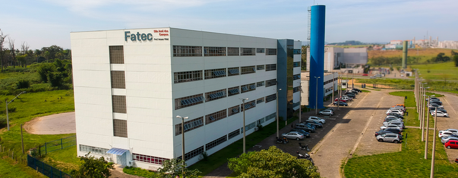

# Portfólio API Tecnólogo em Banco de Dados - William David Antoniazzi

<!-- 
 -->
    

##

Trabalho de graduação na modalidade de Portfólio dos projetos realizados com a metodologia de Aprendizagem por Projetos Integrados (API), necessário como parte dos requisitos para a obtenção do título de Tecnólogo em Banco de Dados pela [FATEC - Faculdade de Tecnologia de São José dos Campos Prof. Jessen Vidal](https://fatecsjc-prd.azurewebsites.net/ "FATEC Prof. Jessen Vidal").

### Índice

- [Sobre o autor](#sobre-o-autor).
- [Meus projetos API](#meus-projetos).

## Sobre o autor

Olá, bem-vindo, tudo bem? 

Eu sou William David Antoniazzi, tenho 37 anos e estou cursando o 5º semestre de Banco de Dados, no qual ingressei no primeiro semestre de 2020. Tenho formação Técnico em Informática pelo [SENAC São José dos Campos/SP](https://www.sp.senac.br/senac-sao-jose-dos-campos), 2007 e Técnologo em Redes de computadores pela [UNICID - Universidade Cidade de São Paulo](https://www.unicid.edu.br/), 2019.

<!-- 
Durante a gradução, a cada semestre é desenvovido um projeto integrando as disciplinas do semestre e problemas reais do mercado de trabalho em parcerias com empresas convidadas pela entidade, API - Aprendizagem por Projetos Integrados.
Com a API tive a oportudade em colocar em prática o conteúdo estudado e pesquisar novas soluções para atender a demanda e construir soluções que atendam o cliente, agregando valor, além de tal base preparar o aluno para os desafios reais do mercado de trabalho. 
 -->

Atualmente, atuo como Analista de Suporte e Infraestrutura em TI na [Sonaca Brasil LTDA](https://www.linkedin.com/company/sonacabrasil), onde sou responsável pelo gerenciamento e planejamento de infraestrutura, rotas de comunicação e integração de ambientes com redes e computadores.

Tenho habilidades em redes de computadores e servidores, switches/roteadores, e, com o tecnólogo, busco aprimorar conhecimentos em SGBD's MySQL, PostgreSQL, Oracle, SQL Server, linguagem de programa Python, Java e PHPb. Também aplico metodologias ágeis para a execução de projetos, como Scrum e Kanban.

 
<b>William Antoniazzi</b>

Suporte, Redes e Infraestrutura em TI

 

<!--
<table border="0" align="center">
    <tr>
        <td colspan="2" align="center"> <b>William Antoniazzi</b></a>  Suporte, Redes e Infraestrutura em TI
        </td>
    </tr>
    <tr align="center">
        <td>
            

            
            

        </td>
        <td>
            

            
            

        </td>
    </tr>
</table>
-->
 

---

## Meus Projetos

1º Semestre 2020-1: [Assistente Pessoal PET](./semesters/sem1_api.md).  
2º Semestre 2020-2: [Sistema de Digitação de Contas DDC](./semesters/sem2_api.md).  
3º Semestre 2022-2: [HexTech - Estações e Clima "ioWEATHER"](./semesters/sem3_api.md).  
4º Semestre 2023-1: [HexTech - Aircraft Configuration Control (ACC)](./semesters/sem4_api.md).  
5º Semestre 2023-2: [Hextech - HEXTaurante](./semesters/sem5_api.md)   
6º Semestre 2025-1:  

## 

[Home](#portfólio-api-tecnólogo-em-banco-de-dados---william-david-antoniazzi)
