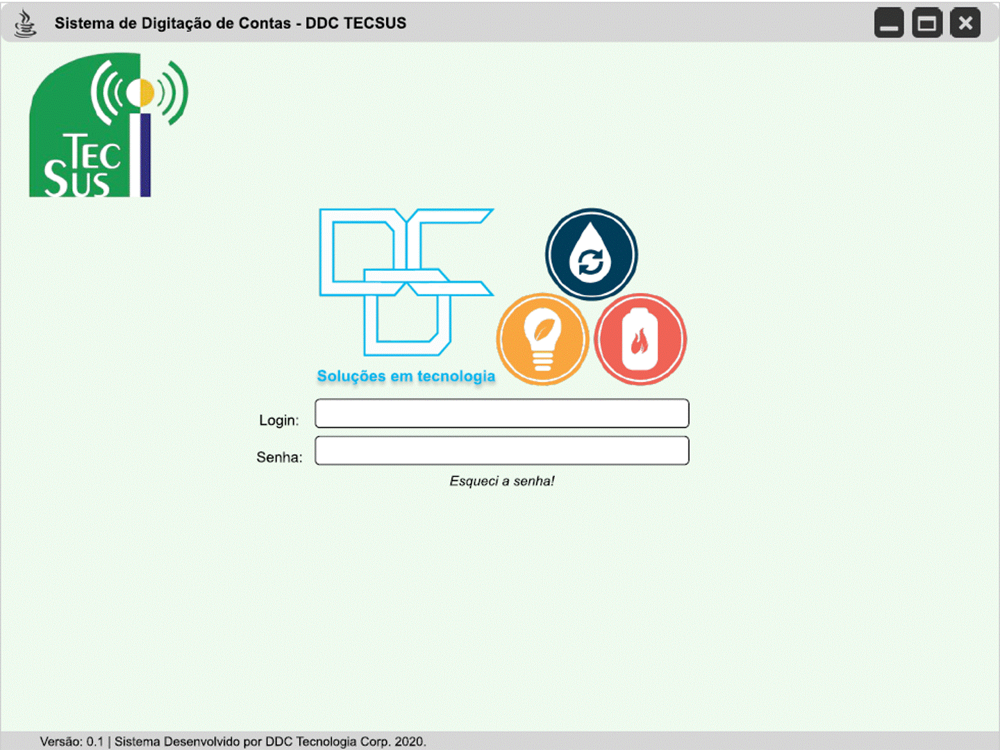

# Portfólio API - Tecnólogo em Banco de Dados

<!-- 
 
    

-->

Trabalho de graduação na modalidade de Portfólio dos projetos realizados com a metodologia de Aprendizagem por Projetos Integrados (API), necessário como parte dos requisitos para a obtenção do título de Tecnólogo em Banco de Dados pela <a href="https://fatecsjc-prd.azurewebsites.net/" target="_blank">FATEC - Faculdade de Tecnologia de São José dos Campos Prof. Jessen Vidal</a>.

### Índice

- [Sobre o autor](#sobre-o-autor-william-david-antoniazzi).
- [Meus projetos API](#meus-projetos).
    - [1º Semestre 2020-1: Fatec - Assistente Pessoal PET](#assistente-pet)
    - [2º Semestre 2020-2: TecSus - Sistema de Digitação de Contas, DDC](#ddc)
    - [3º Semestre 2022-2: IACIT - Sistema Meteorológico, ioWeather](#ioweather)
    - [4º Semestre 2023-1: Embraer - Aircraft Configuration Control, ACC](#acc)
    - [5º Semestre 2026-1: SIATT - Sistema de Controle e Acompanhamento de Recursos, SCAR](#scar)
    - [6º Semestre 2025-2: Pro4Tech - Sistema de Análise de Dados, KPI Cards](#kpi-cards)

## Sobre o autor: William David Antoniazzi

Olá, bem-vindo. 

Eu sou William David Antoniazzi, e estou cursando 6° semestre do Tecnólogo em Banco de Dados, no qual ingressei no primeiro semestre de 2020. Sou formado como Técnico em Informática pelo <a href="https://www.sp.senac.br/senac-sao-jose-dos-campos" target="_blank">SENAC São José dos Campos/SP</a>, 2007 e Tecnólogo em Redes de Computadores pela <a href="https://www.unicid.edu.br/"target="_blank">UNICID - Universidade Cidade de São Paulo</a>, 2019.

Atualmente, atuo como Analista de Suporte e Infraestrutura em TI na <a href="https://www.linkedin.com/company/sonacabrasil" target="_blank">Sonaca Brasil LTDA</a>, onde sou responsável pelo gerenciamento e planejamento de infraestrutura, rotas de comunicação e integração de ambientes com redes e computadores.

Tenho habilidades em redes de computadores e servidores, switches/roteadores, e, com o tecnólogo, busco aprimorar conhecimentos em SGBD relacional e NoSQL linguagem de programa Python, Java e PHP. Também aplicar metodologias ágeis para a execução de projetos, como Scrum e Kanban.

 
<b>William Antoniazzi</b>

Suporte, Redes e Infraestrutura em TI

 

 

---

## Meus Projetos

<h3 id="assistente-pet" style="display: inline;">1º Semestre 2020-1: Fatec - Assistente Pessoal PET</h3>

## Projeto: Assistente Pessoal Pet.

Parceiro Acadêmico: [FATEC Profº. Jessen Vidal](https://fatecsjc-prd.azurewebsites.net/).

## Resumo do projeto.

Projeto proposto pela faculdade FATEC/SJC onde os alunos do primeiro semestre foram orientados pelos alunos formados, 6º Semestre daquele ano.

O escopo deste projeto foi desenvolver um assistente pessoal, que poderia ser mobile, web ou desktop, com o tipo e finalidade definida pela equipe, sendo obrigatória a utilização de um assistente de voz para execução de ações.

A equipe decidiu criar uma aplicação de cuidados para pets, um assistente desktop, utilizando Python para o back-end, Tkinter para o front-end, banco de dados SQL para armazenamento de informações e o assistente de voz do Google para reconhecimento de comandos.

## Tecnologias adotadas.

Front-End: [Tkinter](https://docs.python.org/pt-br/3/library/tkinter.html)

Back-End: [Phyton](https://www.python.org/)

SGBD: [MySQL Community](https://www.mysql.com/products/community/)

Metodologia ágil: [Atlassian Trello](https://trello.com/pt-BR)

## Projeto em funcionamento.

*Wireframes do projeto em funcionamento, link para o youtube*

No assistente, é possível:

- 
Cadastro do dono: Utilizador da aplicação.

- 
Cadastro do Pet: Seja ele cão, gato ou outro animal, que irá receber as dicas e agendamentos pelo app.

- 
Registro do animal: Cadastro dos dados e características do pet.

- 
Registro de ração: Controle da quantidade comprada, quantidade oferecida ao animal e marca do produto.

- 
Registro de lembrete: Agendamento de compromissos no Google Agenda, como datas de banho, consultas veterinárias e outros cuidados.

- 
Registro de peso: Monitoramento da variação de peso do pet com base na alimentação, incluindo um gráfico para acompanhamento.

## Contribuições pessoais.

Atuei como desenvolvedor front-end, utilizando a linguagem Tkinter e contribuição para a modelagem do SGBD MySQL.

Nesta API os desafios foram:

- 
Modelagem e gerenciamento do SGBD relacional MySQL Community.

- 
Utilização de Phyton, Tkinter.

- 
Integração do back-end, front-end e o assistente de voz.

### Back-end

<b>Phyton:</b> Programação é um desafio para mim, e iniciar com o Phyton para conhecer estruturas de linguagem, POO e outros conceitos facilitou a questão de aprendizado, o que possibilitou minha contribuição para criação de alguams partes do projeto como cadastro do pet e controle de ração e trabalhar com validação de dados e controle de excessão.

### Front-end

<b>Tkinter:</b> É uma biblioteca do Python, utilizando mesma linguagem o que facilitou o aprendizado, com este contribuí com a criação de todas as telas do projeto, Controle de ração, Autenticação, Cadastro do pet e realizei a integração Back-end com o Front-end.

### SGBD

<b>MySQL Community:</b> Modelagem de forma eficiente considerando as relações entre as entidades e utlização de triggers para determinadas ações.

### Metodologia ágil

<b>Atlassian Trello:</b> Trello utiliza o paradigma Kanban para gerenciamento de projetos, esta ferramenta foi gerenciada pelo Scrum Master, aluno do 6º Semestre. Nele foram centralizados cards com tarefas para cada membro da equipe da avaliação até sua conclusão.

## Aprendizados efetivos.

### Hard Skills:

- 
<b>Python:</b> Uso com ajuda: primeiro contato com estruturas de linguagem, POO e controle de exceção; contribuição no cadastro de pet e controle de ração.

- 
<b>Tkinter:</b> Uso com ajuda: criação das telas do projeto (autenticação, cadastro do pet, controle de ração) e integração back-end/front-end.

- 
<b>SGBD MySQL Community:</b> Uso com ajuda: modelagem relacional considerando relações entre entidades e uso de triggers.

- 
<b>Metodologia Ágil (Trello/Kanban):</b> Uso com ajuda: participação em cards e tarefas geridos pelo Scrum Master do grupo.

- 
<b>GitHub:</b> Uso com ajuda: versionamento e primeiro contato com fluxo colaborativo em equipe.

### Soft Skills:

- 
<b>Trabalho em Equipe:</b> Início das atividades em grupo do curso, desafio em atingir objetivo sem ainda saber as habilidades de cada um, porém foi um grande aprendizado em saber avaliar o ambiente e habilidade de cada um no grupo para assim auxiliar ou procurar auxilio em determinadas tarefas.

- 
<b>Aprendizado:</b> Buscar fontes confiáveis, materiais complementares e adquirir conhecimento em uma linguagem/SGBD totalmente nova, foram desafios durante o semestre, porém muito válidos para referência no mercado de trabalho e para o andamento dos demais semestres que virão.

- 
<b>Comunicação:</b> Desafio da comunicação por iniciar o trabalho com pessoas novas e com habilidades não niveladas, pois alguns já atuavam na área de programação e outro não, mas ao chegar na 3ª Sprint do projeto conseguimos obter resultados com comunicação clara e assertiva sobre cada escopo e tarefa do projeto.

 

  

    <a href="#assistente-pet">⬆️ Voltar ao topo deste semestre</a> &nbsp; | &nbsp; 
    <a href="#meus-projetos">🏠 Voltar para o início da página</a>
  

 

<h3 id="ddc" style="display: inline;">2º Semestre 2020-2: TecSus - Sistema de Digitação de Contas, DDC</h3>

## Projeto: Sistema de digitação de contas DDC.

Parceiro Acadêmico: [TecSUS Tecnologias para a Sustentabilidade](https://www.tecsus.com.br/).

## Resumo do projeto:

A TecSUS é uma startup de tecnologia da informação, que atua no desenvolvimento de dispositivos, aplicativos e sistemas para transmissão/recepção de dados, controle de equipamentos remotos e gestão da informação, aplicados predominantemente nos setores de abastecimento de água, saneamento, geração e distribuição de eletricidade, distribuição de gás natural e serviços municipais.

O parceiro pediu uma solução para a gestão de contas. Como eles gerenciam o fornecimento de água, luz e gás, para empresas, industrias e agro, recebem mensalmente milhares de contas das prestadoras de serviço que precisam ser digitalizados por um call center, sendo assim o cliente relata:

 - 
Leva-se muito tempo com a digitação manual de cada conta pelo operador.

 - 
Sem controle dos itens para digitação e ou já digitados.

 - 
Erros nas digitações pelos operadores

Como isso o sistema que buscam é melhorar esse controle e digitar apenas os campos importantes.

## Tecnologias adotadas.

Front-End

- [HTML](https://www.w3schools.com/html/default.asp)
- [CSS](https://www.w3schools.com/css/)
- [JavaScript](https://nodejs.org/en)

Back-End

- [Java](https://www.oracle.com/java)
- [SpringBoot](https://spring.io/projects/spring-boot)

SGBD

- [MySQL Community](https://www.mysql.com/products/community/)

Metodologia ágil

- [Atlassian Trello](https://trello.com/pt-BR)

## Projeto em funcionamento.

*Wireframes do projeto em funcionamento, exibição em gif*

A proposta do grupo foi apresentar uma ferramenta leve para ser utilizada via web.Facilitando a digitação dos dados das contas de Energia, Água, Gás e outros de seus clientes.

## Contribuições pessoais.

Contribuí com a modelagem e implementação do SGBD relacional MySQL, algumas telas front-end em HTML/CSS/Javascript e integração do front-end com o back-end.

- 
Modelagem e gerenciamento do SGBD relacional MySQL Community.

- 
Front-end para campos especificos e validação dos dados digitados em HTML/ CSS/ JavaScript.

### Back-end

<b>Java Spring Boot:</b> O Spring Boot é um framework que torna fácil a criação de aplicações Web autossuficientes e robustas, possibilitando a execução imediata. Contudo isso só é possível por conta da abordagem opinativa sobre a plataforma Spring e bibliotecas de terceiros. A utilização desta framework em back-end trouxe facilidade durante a programação com a linguagem Java.

### Front-end

<b>JavaScript:</b> Utilizado para validação dos campos e criar interação nas páginas como menu suspensos, campos do formulário e gráficos.

<b>HTML:</b> Utilizado para estruturar as páginas front-end. A Linguagem de Marcação de Hipertexto é uma linguagem de computador usado para fazer referência a outros textos, enquanto uma linguagem de marcação é composta por uma série de marcações que dizem para os servidores qual é o estilo e a estrutura de um documento.

<b>CSS:</b> CSS é uma linguagem usada para estilizar elementos escritos em uma linguagem de marcação como HTML. Aprendizado e aplicados a linguagem para criar grupos de estilização para a página front-end.

### SGBD

<b>MySQL Community:</b> Modelagem de forma eficiente considerando as relações entre as entidade, utilizando a normalização de Banco de Dados, chegando até a 3ª forma normal, criação e utlização de triggers para determinadas ações.

### Metodologia ágil

<b>Atlassian Trello:</b> Trello utiliza o paradigma Kanban para gerenciamento de projetos. Nele foram centralizados cards com tarefas para cada membro da equipe da avaliação até sua conclusão.

## Aprendizados efetivos:

### Hard Skills:

- 
<b>JavaScript:</b> Uso com ajuda: validação de campos e interações (menus suspensos, formulários, gráficos).

- 
<b>HTML / CSS:</b> Uso com autonomia: estruturação e estilização das páginas front-end do sistema.

- 
<b>Java / Spring Boot:</b> Uso com ajuda: primeiro contato com o framework para construção de aplicação web autossuficiente.

- 
<b>SGBD MySQL Community:</b> Uso com autonomia: modelagem relacional normalizada até a 3ª forma normal, criação de triggers.

- 
<b>Metodologia Ágil (Trello/Kanban):</b> Uso com autonomia: gestão de tasks da equipe durante o período remoto (COVID).

- 
<b>GitHub:</b> Uso com autonomia: versionamento consolidado ao longo do semestre.

### Soft Skills:

- 
<b>Trabalho em Equipe:</b> Trabarlhar em equipe após a primeira API se tornou mais prático e fácil, porém durante o semestre ocorreu COVID e também a utilização das aulas remotas, então neste periódo ao grupo teve que se adaptar com as reuniões e cobranças em tasks.

- 
<b>Gestão de tempo:</b> Com o fator das aulas remotas e entregas e reuniões online, houve uma adaptação e melhoria na gestão de tempo, obtendo mais tempo para estudos e codigos para o projeto.

- 
<b>Estratégia:</b> Com a mudançado no formato das aulas de presencial para remoto devido a COVID, houveram algumas saídas de integrantes do grupo, então, aos que ficaram remanejamos as tarefas, responsabilidades para garantias as entregas com valor para o cliente.

 

  

    <a href="#ddc">⬆️ Voltar ao topo deste semestre</a> &nbsp; | &nbsp; 
    <a href="#meus-projetos">🏠 Voltar para o início da página</a>
  

 

<h3 id="ioweather" style="display: inline;">3º Semestre 2022-2: IACIT - Sistema Meteorológico, ioWeather</h3>

 

Todo o conteúdo vai aqui...

 

<h3 id="acc" style="display: inline;">4º Semestre 2023-1: Embraer - Aircraft Configuration Control, ACC</h3>

 

Todo o conteúdo vai aqui...

 

<h3 id="scar" style="display: inline;">5º Semestre 2026-1: SIATT - Sistema de Controle e Acompanhamento de Recursos, SCAR</h3>

 

Todo o conteúdo vai aqui...

 

<h3 id="kpi-cards" style="display: inline;">6º Semestre 2025-2: Pro4Tech - Sistema de Análise de Dados, KPI Cards</h3>

 

Todo o conteúdo vai aqui...

 

## 

[Home](#portfolio-api---tecnólogo-em-banco-de-dados)
