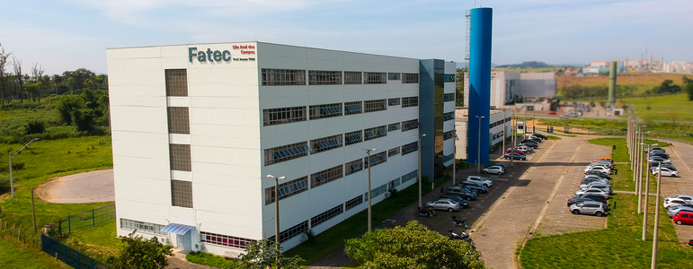

# Portfólio API - Tecnólogo em Banco de Dados

<!-- 
 
    

-->

Trabalho de graduação na modalidade de Portfólio dos projetos realizados com a metodologia de Aprendizagem por Projetos Integrados (API), necessário como parte dos requisitos para a obtenção do título de Tecnólogo em Banco de Dados pela <a href="https://fatecsjc-prd.azurewebsites.net/" target="_blank">FATEC - Faculdade de Tecnologia de São José dos Campos Prof. Jessen Vidal</a>.

### Índice

- [Sobre o autor](#sobre-o-autor-william-david-antoniazzi).
- [Meus projetos API](#meus-projetos).
    - [1º Semestre 2020-1: Fatec - Assistente Pessoal PET](#assistente-pet)
    - [2º Semestre 2020-2: TecSus - Sistema de Digitação de Contas, DDC](#ddc)
    - [3º Semestre 2022-2: IACIT - Sistema Meteorológico, ioWeather](#ioweather)
    - [4º Semestre 2023-1: Embraer - Aircraft Configuration Control, ACC](#acc)
    - [5º Semestre 2026-1: SIATT - Sistema de Controle e Acompanhamento de Recursos, SCAR](#scar)
    - [6º Semestre 2025-2: Pro4Tech - Sistema de Análise de Dados, KPI Cards](#kpi-cards)

## Sobre o autor: William David Antoniazzi

Olá, bem-vindo. 

Eu sou William David Antoniazzi, e estou cursando o Tecnólogo de Banco de Dados, no qual ingressei no primeiro semestre de 2020. Sou formado como Técnico em Informática pelo <a href="https://www.sp.senac.br/senac-sao-jose-dos-campos" target="_blank">SENAC São José dos Campos/SP</a>, 2007 e Tecnólogo em Redes de Computadores pela <a href="https://www.unicid.edu.br/"target="_blank">UNICID - Universidade Cidade de São Paulo</a>, 2019.

Atualmente, atuo como Analista de Suporte e Infraestrutura em TI na <a href="https://www.linkedin.com/company/sonacabrasil" target="_blank">Sonaca Brasil LTDA</a>, onde sou responsável pelo gerenciamento e planejamento de infraestrutura, rotas de comunicação e integração de ambientes com redes e computadores.

Tenho habilidades em redes de computadores e servidores, switches/roteadores, e, com o tecnólogo, busco aprimorar conhecimentos em SGBD relacional e NoSQL linguagem de programa Python, Java e PHP. Também aplicar metodologias ágeis para a execução de projetos, como Scrum e Kanban.

 
<b>William Antoniazzi</b>

Suporte, Redes e Infraestrutura em TI

 

 

---

## Meus Projetos

<h3 id="assistente-pet" style="display: inline;">1º Semestre 2020-1: Fatec - Assistente Pessoal PET</h3>

 

Todo o conteúdo vai aqui...

<h3 id="ddc" style="display: inline;">2º Semestre 2020-2: TecSus - Sistema de Digitação de Contas, DDC</h3>

 

Todo o conteúdo vai aqui...

<h3 id="ioweather" style="display: inline;">3º Semestre 2022-2: IACIT - Sistema Meteorológico, ioWeather</h3>

 

Todo o conteúdo vai aqui...

<h3 id="acc" style="display: inline;">4º Semestre 2023-1: Embraer - Aircraft Configuration Control, ACC</h3>

 

Todo o conteúdo vai aqui...

<h3 id="scar" style="display: inline;">5º Semestre 2026-1: SIATT - Sistema de Controle e Acompanhamento de Recursos, SCAR</h3>

 

Todo o conteúdo vai aqui...

<h3 id="kpi-cards" style="display: inline;">6º Semestre 2025-2: Pro4Tech - Sistema de Análise de Dados, KPI Cards</h3>

 

Todo o conteúdo vai aqui...

 

## 

[Home](#portfolio-api---tecnólogo-em-banco-de-dados)
