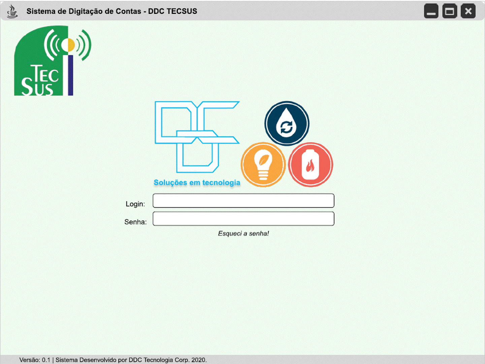

# API 2 - 2º Semestre BD, 2020-2

## Projeto: Sistema de digitação de contas DDC.

Parceiro Acadêmico: [TecSUS Tecnologias para a Sustentabilidade](https://www.tecsus.com.br/).

## Resumo do projeto:

A TecSUS é uma startup de tecnologia da informação, que atua no desenvolvimento de dispositivos, aplicativos e sistemas para transmissão/recepção de dados, controle de equipamentos remotos e gestão da informação, aplicados predominantemente nos setores de abastecimento de água, saneamento, geração e distribuição de eletricidade, distribuição de gás natural e serviços municipais.

O parceiro pediu uma solução para a gestão de contas. Como eles gerenciam o fornecimento de água, luz e gás, para empresas, industrias e agro, recebem mensalmente milhares de contas das prestadoras de serviço que precisam ser digitalizados por um call center, sendo assim o cliente relata:

 - 
Leva-se muito tempo com a digitação manual de cada conta pelo operador.

 - 
Sem controle dos itens para digitação e ou já digitados.

 - 
Erros nas digitações pelos operadores

Como isso o sistema que buscam é melhorar esse controle e digitar apenas os campos importantes.

## Tecnologias adotadas.

Front-End

- [HTML](https://www.w3schools.com/html/default.asp)
- [CSS](https://www.w3schools.com/css/)
- [JavaScript](https://nodejs.org/en)

Back-End

- [Java](https://www.oracle.com/java)
- [SpringBoot](https://spring.io/projects/spring-boot)

SGBD

- [MySQL Community](https://www.mysql.com/products/community/)

Metodologia ágil

- [Atlassian Trello](https://trello.com/pt-BR)

## Projeto em funcionamento.

*Wireframes do projeto em funcionamento, exibição em gif*

A proposta do grupo foi apresentar uma ferramenta leve para ser utilizada via web.Facilitando a digitação dos dados das contas de Energia, Água, Gás e outros de seus clientes.

## Contribuições pessoais.

Contribuí com a modelagem e implementação do SGBD relacional MySQL, algumas telas front-end em HTML/CSS/Javascript e integração do front-end com o back-end.

- 
Modelagem e gerenciamento do SGBD relacional MySQL Community.

- 
Front-end para campos especificos e validação dos dados digitados em HTML/ CSS/ JavaScript.

### Back-end

<b>Java Spring Boot:</b> O Spring Boot é um framework que torna fácil a criação de aplicações Web autossuficientes e robustas, possibilitando a execução imediata. Contudo isso só é possível por conta da abordagem opinativa sobre a plataforma Spring e bibliotecas de terceiros. A utilização desta framework em back-end trouxe facilidade durante a programação com a linguagem Java.

### Front-end

<b>JavaScript:</b> Utilizado para validação dos campos e criar interação nas páginas como menu suspensos, campos do formulário e gráficos.

<b>HTML:</b> Utilizado para estruturar as páginas front-end. A Linguagem de Marcação de Hipertexto é uma linguagem de computador usado para fazer referência a outros textos, enquanto uma linguagem de marcação é composta por uma série de marcações que dizem para os servidores qual é o estilo e a estrutura de um documento.

<b>CSS:</b> CSS é uma linguagem usada para estilizar elementos escritos em uma linguagem de marcação como HTML. Aprendizado e aplicados a linguagem para criar grupos de estilização para a página front-end.

### SGBD

<b>MySQL Community:</b> Modelagem de forma eficiente considerando as relações entre as entidade, utilizando a normalização de Banco de Dados, chegando até a 3ª forma normal, criação e utlização de triggers para determinadas ações.

### Metodologia ágil

<b>Atlassian Trello:</b> Trello utiliza o paradigma Kanban para gerenciamento de projetos. Nele foram centralizados cards com tarefas para cada membro da equipe da avaliação até sua conclusão.

## Aprendizados efetivos:

### Hard Skills:

| Tecnologia/Metodologia | Nível|
| ----- | ----- |
| Metodologia Ágil | ★★☆☆☆ |
| JavaScript | ★★☆☆☆ |
| Spring Boot | ★★☆☆☆ |
| SGBD MySQL | ★★☆☆☆ |
| GitHub | ★★★☆☆|

### Soft Skills:

Trabalho em Equipe:

Trabarlhar em equipe após a primeira API se tornou mais prático e fácil, porém durante o semestre ocorreu COVID e também a utilização das aulas remotas, então neste periódo ao grupo teve que se adaptar com as reuniões e cobranças em tasks.

Gestão de tempo:

Com o fator das aulas remotas e entregas e reuniões online, houve uma adaptação e melhoria na gestão de tempo, obtendo mais tempo para estudos e codigos para o projeto.

Estratégia:

Com a mudançado no formato das aulas de presencial para remoto devido a COVID, houveram algumas saídas de integrantes do grupo, então, aos que ficaram remanejamos as tarefas, responsabilidades para garantias as entregas com valor para o cliente.

 

## Meus Projetos

1º Semestre 2020-1: [Assistente Pessoal PET](./sem1_api.md).  
2º Semestre 2020-2: [Sistema de Digitação de Contas DDC](./sem2_api.md).  
3º Semestre 2022-2: [HexTech - Estações e Clima "ioWEATHER"](./sem3_api.md).  
4º Semestre 2023-1: [HexTech - Aircraft Configuration Control (ACC)](./sem4_api.md).  
5º Semestre 2023-2: [Hextech - HEXTaurante](./sem5_api.md).   
6º Semestre 2025-1:  

#

[Home](../README.md)