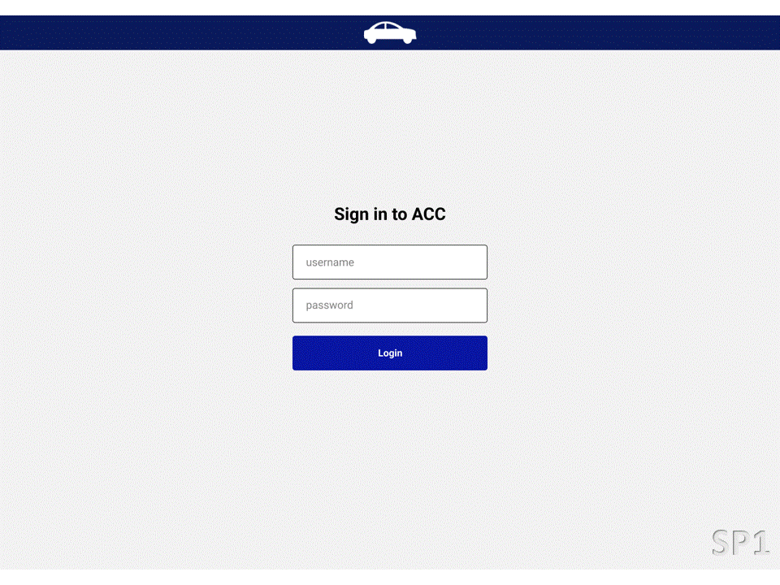

# API 4 - 4º Semestre BD, 2023-1

## Projeto: Aircraft Configuration Control (ACC)

Parceiro Acadêmico: [EMBRAER SA](https://embraer.com/br/pt).

## Resumo do projeto.

A Embraer é uma das maiores fabricantes de aeronaves do mundo, com sede em São José dos Campos, no Brasil. Fundada em 1969 como uma empresa estatal e privatizada em 1994, ela é pioneira na fabricação de aviões comerciais de médio porte, com destaque para as linhas ERJ e E-Jet, amplamente utilizadas por companhias aéreas regionais. Além do setor comercial, a Embraer atua na aviação executiva, com jatos como o Phenom e o Praetor, e na área militar, onde se destaca com o cargueiro KC-390 e a aeronave de ataque leve A-29 Super Tucano.

A empresa também investe em tecnologia e inovação, desenvolvendo soluções para mobilidade aérea urbana e exploração de combustíveis sustentáveis. Reconhecida pela excelência em engenharia e inovação, a Embraer mantém alianças globais estratégicas e conta com fábricas e centros de serviços espalhados pelo mundo

Desenvolvimento de um sistema em plataforma web de Controle de Configuração de Aeronaves (ACC). Trata-se de um ambiente responsivo e intuitivo que facilita o gerenciamento e o controle das configurações das aeronaves, permitindo aos pilotos verificar, comparar itens e identificar limitações operacionais.

## Tecnologias adotadas.

Front-End

- [JavaScript (ES6)](https://www.javascript.com)
- [HTML5](https://www.w3schools.com/css/)
- [CSS3](https://www.w3schools.com/css/)
- [Vue 3](https://vuejs.org/guide/quick-start)

Back-End

- [Java](https://www.java.com/pt-BR/)
- [Spring boot](https://spring.io/projects/spring-boot)
- [Apache Maven](https://maven.apache.org/)
- [Hibernate](https://hibernate.org/)

SGBD

- [Oracle Autonomous Database](https://www.oracle.com/br/autonomous-database/)

Metodologia ágil

- [Atlassian JIRA](https://www.atlassian.com/br/software/jira)

## Projeto em funcionamento.

*Telas do projeto em funcionamento*

## Contribuições pessoais.

Atuando como desenvolvedor com back-end utilizando Java e Springboot e também com o SGBD Oracle Autonomous, base em cloud, realizando a modelagem e gerenciamento para a plataforma web.

Nesta API os desafios encontrados foram:

- Modelagem e gerenciamento do SGBD relacional Oracle Autonomous.
- Utilização de Springboot e Arquitetura rest.
- Manipulação de listas em linguagem Java.
- Utilização de código limpo em POO.

### Back-end

<b>Springboot:</b> Contribuí na implementação do projeto com SpringBoot, Spring Security e Spring Data, criando o dashboard e cards via requisições HTTP em arquitetura REST. O Spring Security foi usado para criptografia de dados sensíveis, enquanto o Spring Data facilitou operações com o banco de dados.

<b>Java:</b> Aprimorei habilidades em tratamento de exceções e no uso de listas e arrays para manipular dados oriundos do banco Oracle.

### SGBD  

<b>Conexão do Autonomous Database:</b> Realizei a conexão do banco de dados à aplicação por meio da pasta Wallet e configurei todo o ambiente necessário para o banco de dados hospedado.

<b>Modelagem de Dados:</b> Contribuí para a modelagem de dados eficiente, considerando relações entre entidades e as necessidades da Embraer, assegurando uma estrutura intuitiva e otimizada para consultas frequentes.

<b>Implementação de SQL e PL/SQL:</b> Desenvolvi consultas SQL eficientes e utilizei PL/SQL para criar procedimentos e funções para consultas, inserts e updates otimizadas.

## Aprendizados efetivos.

### Hard Skills:

| Tecnologia/ Metodologia | Nível|
| ----- | ----- |
| Metodologia Ágil | ★★★☆☆ |
| Java e Spring Boot | ★★☆☆☆ |
| PL/SQL | ★★★★☆ |
| Oracle Autonomous | ★★☆☆☆ |

<!--
**Soft Skills**
| Habilidade | Classificação |
| ----- | ----- |
| Estratégico | ★★★★★★☆☆☆☆ |
| Analítico | ★★★★★☆☆☆☆☆ |
| Organização | ★★★★★★★☆☆☆ |
| Foco | ★★★★★★★★☆☆ |
| Empatia | ★★★★☆☆☆☆☆☆ |

 

## Hard Skills

* JavaScript - Intermediário
* CSS - Intermediário
* Vue - Básico
* Chart.JS - Básico
* Banco de dados - Intermediário
* Autonomous Database - Básico
-->
### Soft Skills:

Gestão de Tempo:

Gerenciei o tempo de forma eficaz em um grupo com o menor numero de participantes e tivemos algumas baixas ao longo do semestre, mas com a gestão de tempo consegui garantir o desenvolvimento do projeto dentro dos prazos de sprints.

Comunicação:

Foco na comunicação clara entre cliente, PO e equipe para evitar mal-entendidos e garantir o alinhamento das entregas.

Trabalho em Equipe:

Colaboração e suporte mútuo, aproveitando habilidades individuais para um ambiente de sinergia em busca dos objetivos do projeto.

 

## Meus Projetos

1º Semestre 2020-1: [Assistente Pessoal PET](./sem1_api.md).  
2º Semestre 2020-2: [Sistema de Digitação de Contas DDC](./sem2_api.md).  
3º Semestre 2022-2: [HexTech - Estações e Clima "ioWEATHER"](./sem3_api.md).  
4º Semestre 2023-1: [HexTech - Aircraft Configuration Control (ACC)](./sem4_api.md).  
5º Semestre 2023-2: [HexTech - HEXTaurante](./sem5_api.md)   
6º Semestre 2025-1:  

#

[Home](../README.md)