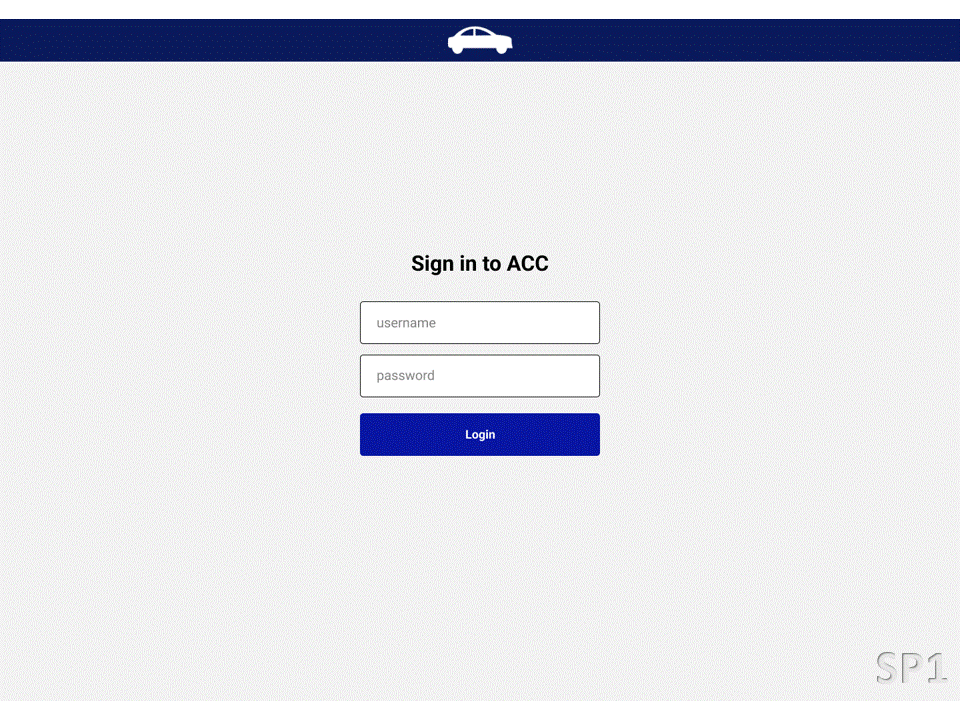

# API 6 - 6º Semestre BD, 2025-1 [FAZER]

## Projeto: HexTech

Parceiro Acadêmico: [HexTech](https://github.com/GroupHextech).

## Resumo do projeto.
<!--

Desenvolver um sistema de Controle de Configuração de Aeronaves (ACC) para a Embraer, empresa líder em aviação comercial, civil, militar e agrícola.

Plataforma Web responsiva e intuítiva que possa proporcionar o gerenciamento e controlar as configurações das aeronaves, permitindo assim aos pilotos verificarem as configurações da aeronave, comparar itens e identificar limitações dos itens que operam.

-->
## Tecnologias adotadas.
<!--

Front-End

- [JavaScript (ES6)](https://www.javascript.com)
- [HTML5](https://www.w3schools.com/css/)
- [CSS3](https://www.w3schools.com/css/)
- [Vue 3](https://vuejs.org/guide/quick-start)

Back-End

- [Java](https://www.java.com/pt-BR/)
- [Spring boot](https://spring.io/projects/spring-boot)
- [Apache Maven](https://maven.apache.org/)
- [Hibernate](https://hibernate.org/)

Banco de Dados

- [Oracle Autonomous Database](https://www.oracle.com/br/autonomous-database/)

Metodologia ágil

- [Atlassian JIRA](https://www.atlassian.com/br/software/jira)
-->
## Projeto em funcionamento.
<!--

*Wireframes do projeto em funcionamento, exibição em gif*
*Wireframes do projeto em funcionamento, link para o youtube*
-->
## Contribuições pessoais.
<!--

Atuando como desenvolvedor com back-end e modelagem e gerenciamento do banco de dados em Oracle Cloud.

Nesta API os desafios foram:

- Modelagem e gerenciamento do Banco de Dadaos relacional no Oracle Autonomous.
- Utilização de Springboot e Arquitetura rest.
- Utilização de listas em Java.

Banco de Dados

  
### Conexão do Autonomous Database:

Executei a conexão do banco de dados com a aplicação, por meio da pasta Wallet e configurando todo o ambiente em que o Banco de dados estava hospedado.

### Modelagem de Dados:

Contribui para a modelagem de dados de forma eficiente, considerando as relações entre entidades e as necessidades específicas da Embraer. Garanti que a estrutura do banco de dados fosse intuitiva e otimizada para consultas frequentes.

### Implementação de SQL e PL/SQL:

Desenvolvi consultas SQL eficientes para atender às demandas do aplicativo. Utilizei PL/SQL quando necessário para criar procedimentos armazenados e funções que possam melhorar o desempenho.

Back-end

### Springboot:

Implementado o projeto utilizando Spring Boot, Spring Security e Spring Data. Com Spring Boot, alimentei o dashboard e cards via requisições HTTP em arquitetura REST. O Spring Security foi aplicado para criptografar dados sensíveis, e o Spring Data, para operações com o banco de dados.

### Java:

Aprendizado em tratamento de execeções em back-end java, e utilização de listas e arrays para manipulação com dados buscados do banco de dados Oracle.

-->
## Aprendizados efetivos.

### Hard Skills:

| Tecnologia/Metodologia | Classificação|
| ----- | ----- |
| Metodologia Ágil | ★★★☆☆ |
| Java e Springboot | ★★☆☆☆ |
| PL/SQL | ★★★★☆ |
| Oracle Autonomous | ★★☆☆☆ |

### Soft Skills:
<!--
#### Gestão de Tempo:

Grupo com o menor número de participantes em relação aos demais e com algumas baixas ao longo do semestre a gestão de tempo foi fundamental para o desenvolvimento do projeto acompanhando cada tasks com atenção aos prazos e entregas de sprints.

#### Comunicação:

Comunicação e troca de informações de forma clara entre cliente, PO e membros do grupo, evitando assim mal-entedimentos e garantindo alinhamento em busca do objetivo que é a entrega da sprint e projeto final.

#### Trabalho em Equipe:

Colaboração e o apoio mútuo, permitindo que as habilidades individuais se complementem, resultando assim em um ambiente em que todos buscam alcançar os objetivos do projeto.

-->
 

## Meus Projetos

1º Semestre 2020-1: [Assistente Pessoal PET](./sem1_api.md).  
2º Semestre 2020-2: [Sistema de Digitação de Contas DDC](./sem2_api.md).  
3º Semestre 2022-2: [HexTech - Estações e Clima "ioWEATHER"](./sem3_api.md).  
4º Semestre 2023-1: [HexTech - Aircraft Configuration Control (ACC)](./sem4_api.md).  
5º Semestre 2023-2: [HexTech - HEXTaurante](./sem5_api.md)   
6º Semestre 2025-1:  

#

[Home](../README.md)